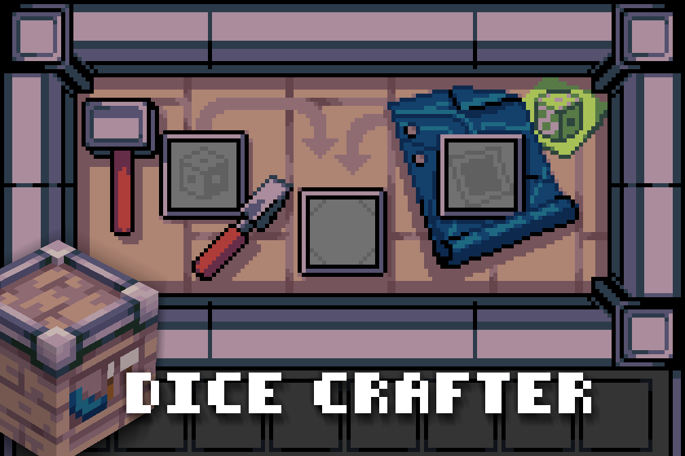

# Dice Crafter


Craft templates together with blueprints to craft dice.

API for crafting custom Dice with [Dice API](https://github.com/Extex/dice_api). 


```lua
dice_crafter.register_blueprint("my_dice_pack:blueprint", {
    recipes = {
        {
            "dice_crafter:template_coin",   -- Input
            "my_dice_pack:coin"             -- Output
        }
        {
            "dice_crafter:template_d6",     -- Input
            "my_dice_pack:d6"               -- Output
        },
        -- ect.
    },
    -- See [DiceAPI](https://github.com/Extex101/dice_api/blob/main/api.md#die-definition) for more information on tooltip coloring. 
    -- Alternatively, you can use description = "" for default behavior
    tooltip_colors = {
        MINE = "#a2a85b"
    },
    tooltip = {"\\MINE\\My Dice Blueprint!"},
    inventory_image = "my_dice_pack_blueprint.png",
    groups = {dice_blueprint_my_dice_pack = 1}
})
```